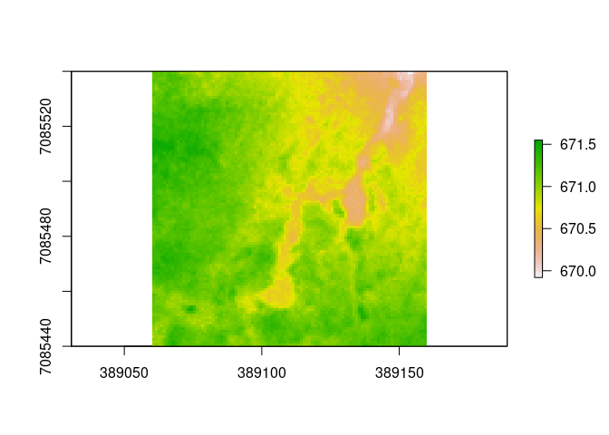
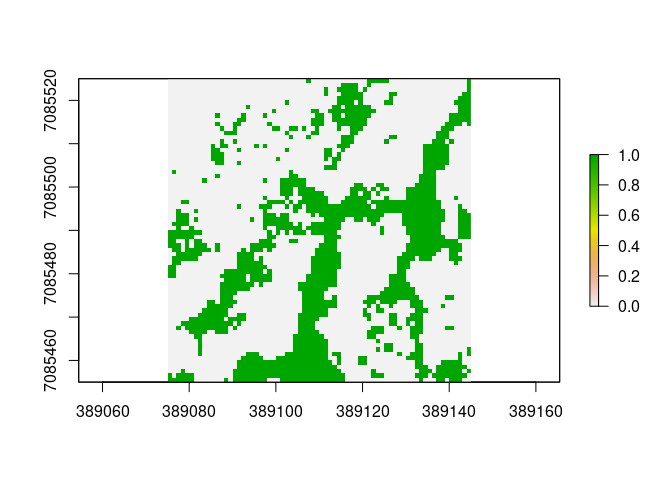
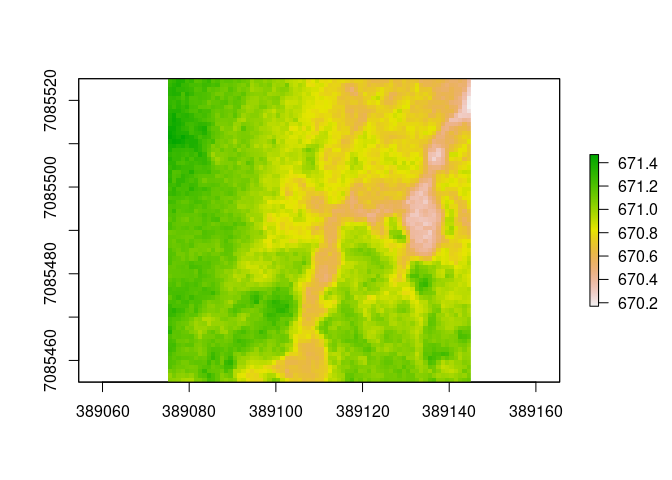
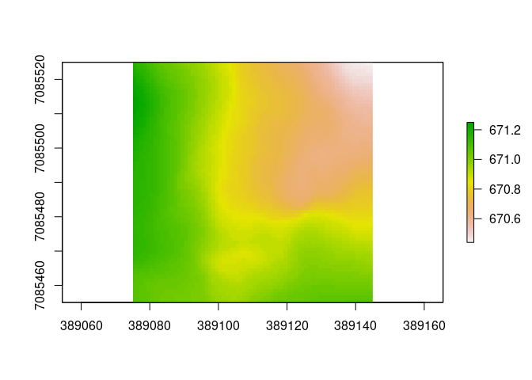
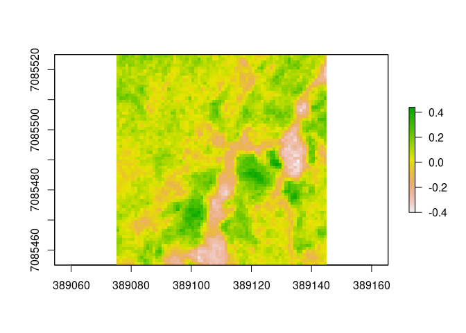

<!-- README.md is generated from README.Rmd. Please edit that file -->

# thermokarstdetection

<!-- badges: start -->
<!-- badges: end -->

The package thermokarstdetection provides a function to easily detect
thermokarst features from a single digital terrain model (ground surface
elevation raster). It identifies cells which are at lower elevation than
the surrounding landscape by using a neighborhood function to calculate
the average (either median or mean) elevation in one or more
user-defined neighborhoods.

## Installation

You can install the development version from
[GitHub](https://github.com/) with:

``` r
# install.packages("devtools")
devtools::install_github("HRodenhizer/thermokarstdetection")
```

## Example

This is a basic example which shows you how to detect thermokarst
features using the default options:

``` r
library(thermokarstdetection)
library(raster)
#> Loading required package: sp

### Inspect some elevation data
tk_ponds
#> class      : RasterBrick 
#> dimensions : 100, 100, 10000, 2  (nrow, ncol, ncell, nlayers)
#> resolution : 1, 1  (x, y)
#> extent     : 389060, 389160, 7085440, 7085540  (xmin, xmax, ymin, ymax)
#> crs        : +proj=utm +zone=6 +datum=WGS84 +units=m +no_defs 
#> source     : memory
#> names      : NEON_DTM_2017, NEON_DTM_2018 
#> min values :        669.92,        670.06 
#> max values :        671.55,        671.72
plot(tk_ponds[[1]])
```



``` r
### Use tk_detect() to find thermokarst features
tk <- tk_detect(tk_ponds)
```

The main output of `tk_detect()` is a categorical raster of thermokarst
class:

``` r
# inspect cropped thermokarst output
plot(tk$thermokarst[[1]][[1]])
```



However, it also returns intermediate data products. `elev.crop` is a
version of the input elevation raster which has been cropped to the
maximum possible output extent of the neighborhood function output:

``` r
plot(tk$elev.crop[[1]])
```



`avg.elev` is the average neighborhood elevation (either median or mean,
as specified by the user):

``` r
plot(tk$avg.elev[[1]][[1]])
```



`microtopography` is a raster of the deviation in elevation from the
average elevation, defined as `elev.crop - avg.elev`:

``` r
plot(tk$microtopography[[1]][[1]])
```



The output of `tk_detect()` reports the input parameters (radii, fun,
cutoff) which were used, as well. `radii` can be either a single value
or a vector of radii which determine(s) the neighborhood size when
calculation the average elevation. `fun` is the function to use when
calculating the neighborhood average elevation (either median or mean).
`cutoff` is the value used to classify microtopography as thermokarst.

``` r
tk$radii
#> [1] 15
tk$fun
#> [1] "median"
tk$cutoff
#> [1] 0
```
